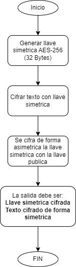

# aes-rsa-encryption
Software to encrypt data using AES and RSA encryption methods

# AES Encryption method


# RSA Encryption method


# AES-RSA Encryption method

## AES-RSA Encrypt



## AES-RSA Decrypt


## Environment Variables

To run this project, you will need to add the following environment variables to your .env file

`PORT: [your node server port], Example: 3000`

`ENVIRONMENT: [your environment], Example: dev | qa`

## Installation
For install the project, follow the steps:

1.- Clone project with git:

```bash
  git clone https://github.com/jemgdev/aes-rsa-encryption-tool.git
```

2.- Then go to the project:

```bash
  cd aes-rsa-encryption-tool
```

3.- Then you must install all packages with the command:

```bash
  npm install
```

Finally run the project in http://localhost:{PORT} using:

```bash
  npm start
```